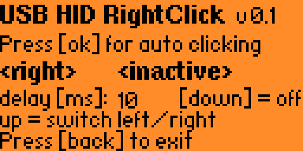

# USB HID Autofire

[GitHub]([https://github.com/pbek/usb_hid_autofire](https://github.com/hackerman103020/usb_hid_left-right_autoclicker)) |
[Latest release]([https://github.com/pbek/usb_hid_autofire/releases/latest](https://flipc.org/hackerman103020/usb_hid_left-right_autoclicker)) |
[Changelog](CHANGELOG.md) |
[License](LICENSE)

[](https://github.com/pbek/usb_hid_autofire/actions/workflows/build-test.yml)

This is a simple Flipper Zero application to send left/right-clicks as a USB HID device.
this is a fork of: https://github.com/pbek/usb_hid_autofire



## Use-case

- Great for auto-clicking in games like [Idle Wizard](https://store.steampowered.com/app/992070/Idle_Wizard/) 😁

## Installation

Download the [latest release](https://flipc.org/hackerman103020/usb_hid_left-right_autoclicker)
of the *fap* file and put it into the `apps` folder on your SD card of your Flipper Zero. 

## Building

```shell
cd applications_user
git clone https://github.com/hackerman103020/usb_hid_left-right_autoclicker.git

cd ..

# Build the application
./fbt fap_usb_hid_left-right_autoclicker

# Build and launch the application
./fbt launch_app APPSRC=usb_hid_left-right_autoclicker
```
